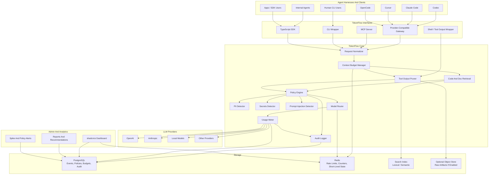
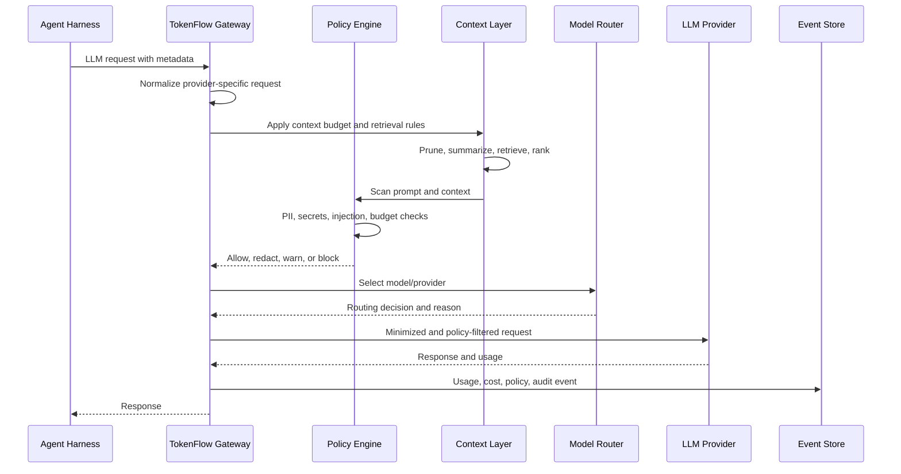
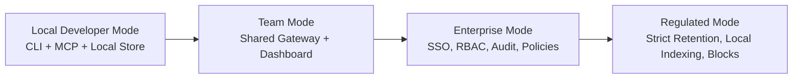
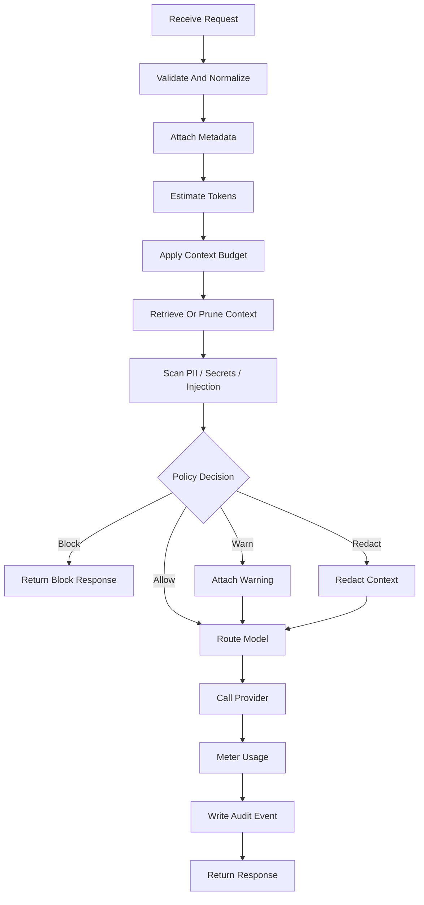

# TokenFlow Architecture

TokenFlow is a TypeScript-first, harness-agnostic control plane for reducing LLM token spend, limiting unnecessary data exposure, and observing agentic AI usage across tools.

The same core platform should work for individuals, small teams, SMBs, and enterprises. The difference is not the core engine. The difference is the depth of governance, deployment options, auditability, policy enforcement, and administrative control.

## Goals

- Reduce unnecessary LLM input tokens before requests reach providers.
- Give users and admins clear visibility into token spend and waste sources.
- Work across approved agent harnesses instead of replacing them.
- Inherit existing access policies instead of creating a new broad-access platform.
- Detect and redact PII, secrets, and sensitive business data.
- Route work to cheaper or stronger models based on task type and risk.
- Expose useful capabilities through API, MCP, CLI, and dashboard surfaces.
- Support simple local use and enterprise-grade central governance.

## Non-Goals

- TokenFlow is not a new agent harness.
- TokenFlow is not a compliance guarantee by itself.
- TokenFlow should not become the source of truth for repo, cloud, database, or ticketing permissions.
- TokenFlow should not store raw prompts, raw tool output, or raw sensitive data unless explicitly configured.

## High-Level Architecture



## Request Flow



## Core Modules

### Gateway

The gateway accepts provider-compatible requests and agent metadata. It should support OpenAI-compatible and Anthropic-compatible proxy modes first, then additional providers.

Responsibilities:

- normalize requests
- attach metadata
- enforce configured policy
- route requests
- meter usage
- emit audit events
- preserve provider compatibility where possible

### MCP Server

The MCP server exposes TokenFlow capabilities directly to agents.

Useful tools:

```text
search_code
summarize_tool_output
estimate_tokens
detect_pii
detect_secrets
choose_model
get_startup_context
explain_policy_decision
```

### CLI

The CLI gives individuals and teams immediate value without requiring a full gateway deployment.

Useful commands:

```bash
tokenflow search "where auth refresh happens"
tokenflow summarize build.log
tokenflow pii-scan output.txt
tokenflow secrets-scan output.txt
tokenflow budget status
tokenflow run pytest
```

### Context Layer

The context layer reduces input tokens before provider calls.

Capabilities:

- startup context injection
- code retrieval
- document retrieval
- lexical search
- semantic search
- context ranking
- file summarization
- command-output pruning
- log summarization
- prompt-cache layout hints

The preferred strategy is indexed retrieval first and output pruning second.

### Policy Engine

The policy engine decides whether a request is allowed, redacted, warned, blocked, or routed differently.

Inputs:

- user/team/repo/harness metadata
- data classification
- prompt and context scan results
- model/provider policy
- budget state
- environment profile

Outputs:

- allow
- redact
- warn
- block
- route
- audit

### PII And Secrets Detection

PII and secrets detection should happen before model calls and before sensitive events are persisted.

Modes:

- `observe`
- `warn`
- `redact`
- `block`
- `hash`
- `allowlist`

### Model Router

The model router chooses models by task type, risk, budget, policy, latency, and provider availability.

Example routing:

- exploratory search -> cheaper model
- summarization -> cheaper model
- low-risk classification -> cheaper model
- architecture reasoning -> stronger model
- code modification planning -> stronger model
- high-risk production operation -> strongest approved model or block

### Usage Meter

The usage meter records:

- input tokens
- output tokens
- cached tokens
- tool-result size
- estimated cost
- actual cost when available
- model/provider
- team/user/repo/harness/task attribution

### Audit And Events

The audit layer records policy decisions and cost events. Enterprise deployments should support immutable or append-only audit storage.

Events:

- request normalized
- policy scanned
- PII detected
- secret detected
- prompt injection suspected
- request redacted
- request blocked
- model routed
- usage recorded
- spike detected

## Deployment Modes



### Local Developer Mode

For individuals.

- local CLI
- local MCP server
- local SQLite or file-backed event store
- local-only PII/secrets scan
- local output pruning
- optional local code index
- no central admin required

### Team Mode

For small teams and SMBs.

- shared gateway
- shared dashboard
- team budgets
- provider key management
- basic policy profiles
- project-level usage reports
- basic PII/secrets redaction
- basic model routing

### Enterprise Mode

For larger companies.

- SSO
- RBAC
- SCIM or directory sync
- centralized policy management
- audit logs
- retention controls
- data classification
- per-business-unit budgets
- model/provider allowlists
- advanced routing
- spike detection
- SIEM export
- private deployment
- approval workflows

### Regulated Mode

For high-security or regulated environments.

- local-only or private-cloud indexing
- raw prompt retention disabled by default
- raw tool-output retention disabled by default
- stricter PII/secrets blocking
- immutable audit export
- isolated tenant storage
- customer-managed keys
- private networking
- stricter model/provider allowlists

## Feature Tiers

The platform should keep a useful free or individual path while monetizing features that create enterprise value.

| Capability | Individual | SMB / Team | Enterprise |
| --- | --- | --- | --- |
| CLI output pruning | Yes | Yes | Yes |
| Local MCP tools | Yes | Yes | Yes |
| Local token estimation | Yes | Yes | Yes |
| Local PII/secrets scan | Yes | Yes | Yes |
| Local code search | Yes | Yes | Yes |
| Shared gateway | No | Yes | Yes |
| Dashboard | Basic local | Team dashboard | Enterprise dashboard |
| Team budgets | No | Yes | Yes |
| Model routing | Basic | Team policy | Advanced policy |
| Central event store | No | Yes | Yes |
| SSO/RBAC | No | Optional | Yes |
| SCIM/directory sync | No | No | Yes |
| Audit logs | Local only | Basic | Advanced/immutable |
| SIEM export | No | No | Yes |
| Data classification | No | Basic | Advanced |
| Retention policy | Local setting | Team setting | Enterprise policy |
| Provider allowlists | Basic | Team | Enterprise |
| Spike detection | Local | Team | Advanced |
| Policy approval workflows | No | No | Yes |
| Private deployment | No | Optional | Yes |
| Customer-managed keys | No | No | Yes |
| Multi-tenant admin | No | No | Yes |

## Enterprise Monetization Candidates

Features that are most naturally enterprise-only:

- SSO/RBAC
- SCIM
- immutable audit logs
- SIEM export
- private deployment
- customer-managed keys
- advanced retention policy
- data classification
- organization-wide model/provider allowlists
- centralized policy packs
- policy approval workflows
- advanced anomaly detection
- spend allocation by org structure
- compliance reporting
- multi-tenant admin
- vendor/provider risk controls

Features that should remain available to individuals or small teams:

- CLI
- MCP server
- local token estimation
- local output pruning
- local PII/secrets scanning
- local code search
- basic dashboard
- basic model routing

## Suggested TypeScript Backend Structure

```text
apps/
  api/
    src/
      app.ts
      routes/
      middleware/
  dashboard/
    src/
      app/
      components/
      lib/
  cli/
    src/
      index.ts
  mcp/
    src/
      server.ts

packages/
  core/
    src/
      normalize/
      context/
      policy/
      routing/
      metering/
      audit/
  config/
    src/
      profiles.ts
      schema.ts
  detectors/
    src/
      pii.ts
      secrets.ts
      prompt-injection.ts
  retrieval/
    src/
      lexical.ts
      semantic.ts
      indexer.ts
  providers/
    src/
      openai.ts
      anthropic.ts
      local.ts
  storage/
    src/
      postgres.ts
      redis.ts
      sqlite.ts
  test-fixtures/
    src/
```

## Suggested Technology Choices

- TypeScript for backend, CLI, MCP, dashboard, and shared libraries
- Fastify or Hono for backend APIs
- React with shadcn/ui for the dashboard
- PostgreSQL for production event, audit, policy, and usage data
- Redis for counters, rate limits, and short-lived state
- SQLite for local individual mode
- Zod for schemas and policy validation
- Vitest for unit and integration tests
- OpenTelemetry for traces and metrics
- Testcontainers for database integration tests

## Backend Control Flow



## TDD Foundation

The backend should be developed test-first around behavior.

Initial test groups:

- request normalization
- PII detection
- secrets detection
- context budgeting
- tool-output pruning
- model routing
- usage metering
- audit logging
- retention policy
- dashboard metrics queries

The first milestone should use fake providers and fake storage so the request pipeline can be proven before any real provider integration.

```text
request
-> normalize
-> scan
-> budget
-> route
-> fake provider
-> meter
-> audit
-> response
```

The second milestone should add persistent storage, provider-compatible gateway endpoints, CLI commands, and basic MCP tools.

The third milestone should add the dashboard, shared team mode, budget alerts, and spike detection.

Enterprise controls should be added only after the core event and policy model is stable.

## Open Questions

- Should local mode use SQLite only, or should it also support Postgres for power users?
- Should semantic indexing be optional from day one?
- Should the first gateway be OpenAI-compatible only, or OpenAI and Anthropic together?
- Should raw prompt and raw tool-output retention default to off across all modes?
- Should enterprise customers be able to bring their own DLP provider?
- Should model routing be fully deterministic policy at first?
- Should CLI command wrapping execute commands directly, or only summarize files/output passed to it?
